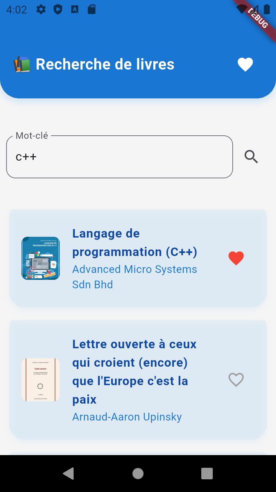
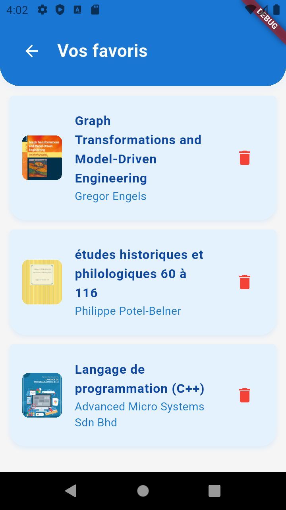

# Book App Flutter

Une application Flutter simple et élégante permettant de rechercher des livres via l'API Google Books [📘 Documentation officielle Google Books API (FR)](https://developers.google.com/books/docs/v1/using?hl=fr) et de sauvegarder ses livres favoris localement avec SQLite.


## Aperçus de l'application

### Page d'accueil (Recherche de livres)



### Page des favoris




## Fonctionnalités

* Recherche de livres via [Google Books API](https://developers.google.com/books/)
* Affichage des résultats sous forme de cartes stylées
* Ajout aux favoris (stockage local SQLite)
* Suppression de livres favoris
* Interface moderne avec AppBar personnalisé


## Structure du projet

```
lib/
├── models/            # Modèles de données (Book)
├── services/          # API Google Books & SQLite locale
├── pages/             # Pages principales de l'app
├── widgets/           # Composants réutilisables (BookCard)
└── main.dart          # Point d'entrée de l'application
```


## Fonctionnement

### Page d'accueil

* Recherche de livres via champ de texte
* Appel à `ApiService.fetchBooks()`
* Affichage dynamique des résultats avec `BookCard`

### Ajout aux favoris

* Icône ❤️ cliquable dans chaque `BookCard`
* Donnée stockée dans SQLite via `DBService.insertItem()`

### Page Favoris

* Récupère via `DBService.getItems()`
* Liste stylisée avec options de suppression
* Bouton retour dans un header arrondi


## Packages utilisés

| Package              | Rôle                              |
| -------------------- | --------------------------------- |
| `http`               | Appels API HTTP                   |
| `sqflite`            | Base de données locale (mobile)   |
| `sqflite_common_ffi` | Base de données sur desktop       |
| `path`               | Construction du chemin de fichier |

